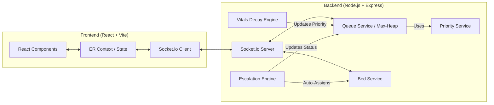
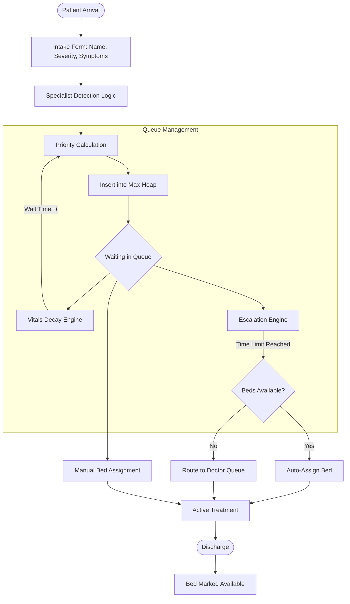

# 🏥 ER Priority Engine v4.1.0


The **ER Priority Engine** is a state-of-the-art, real-time triage and bed management system designed for Emergency Departments (ED). It leverages a robust Max-Heap priority queue on the backend, continuously recalculating patient priorities based on severity, wait times (Vitals Decay Engine), and systemic load.

---

## 🏗️ System Architecture

The system is built on a decoupled architecture where the backend acts as a deterministic state machine, and the frontend provides a reactive interface.



---

## 🔄 Operational Workflow

The following flowchart outlines the lifecycle of a patient within the ER Priority Engine, from intake to discharge.



---

## ✨ Key Features

- ⚡ **Real-Time Synchronization**: Instantaneous state updates across all connected clients using Socket.io.
- 🩺 **Intelligent Symptom-Based Triage**: Automatic specialist assignment (Cardiologist, Orthopedic, etc.) based on symptom keywords.
- 🚨 **Accident Auto-Escalation**: High-severity accident cases unlock immediate "CALL SURGEON" protocols.
- 🛏️ **Dynamic Bed Management**: ER and OPD bed oversight with **Preemptive Bed Reservation** for incoming ambulances.
- 📉 **Vitals Decay Engine**: Background process that increases patient priority scores the longer they wait, preventing "queue starvation."
- ⚠️ **MCI Mode (Mass Casualty Incident)**: A triage shift from "Wait-Time Fairness" to "Maximum Survivability" logic.

---

## 🛠️ Technology Stack

### Frontend
- **Framework**: React (Vite)
- **Language**: TypeScript
- **Styling**: Vanilla CSS (Premium Custom Design)
- **Animation**: Framer Motion
- **Icons**: Lucide React
- **Real-time**: Socket.io-client

### Backend
- **Runtime**: Node.js
- **Server**: Express.js
- **Real-time**: Socket.io
- **Logic**: Custom Max-Heap Priority Queue (Manual implementation)
- **Engines**: Background Vitals Decay & Escalation Engines

---

## 🚀 Getting Started

### Prerequisites
- [Node.js](https://nodejs.org/) (v18 or higher)
- [npm](https://www.npmjs.com/)

### Installation

1. **Clone the repository**:
   ```bash
   git clone <repository-url>
   cd devwrap2.0
   ```

2. **Setup Backend**:
   ```bash
   cd backend
   npm install
   npm run dev
   ```

3. **Setup Frontend**:
   ```bash
   cd ../frontend
   npm install
   npm run dev
   ```

---

## 💻 Usage Guide

1. **Initialization**: Navigate to the **Protocol Page** to configure your bed layout and seed doctors.
2. **Patient Intake**: Use the sidebar to add patients. Enter symptoms like "chest pain" or "broken leg" to see auto-specialist mapping.
3. **Monitoring**: Watch the live dashboard. The queue sorts automatically based on the priority score.
4. **Action**: Click "Assign Bed" to move the highest priority patient to an available bed, or use "Call Surgeon" for critical escalations.
5. **MCI Toggle**: In case of a mass casualty event, toggle MCI mode to see the priority algorithm shift in real-time.

---

## 📁 Project Structure

```text
devwrap2.0/
├── backend/
│   ├── services/         # Core logic (Heap, Decay, Escalation, Bed)
│   ├── socket/           # Real-time event handlers
│   └── server.js         # Entry point
└── frontend/
    ├── src/
    │   ├── context/      # ER Global State Management
    │   ├── pages/        # Dashboard, Protocol, Landing
    │   └── components/   # UI Modules
```

---
*Developed for advanced agentic coding and medical automation demonstrations.*
